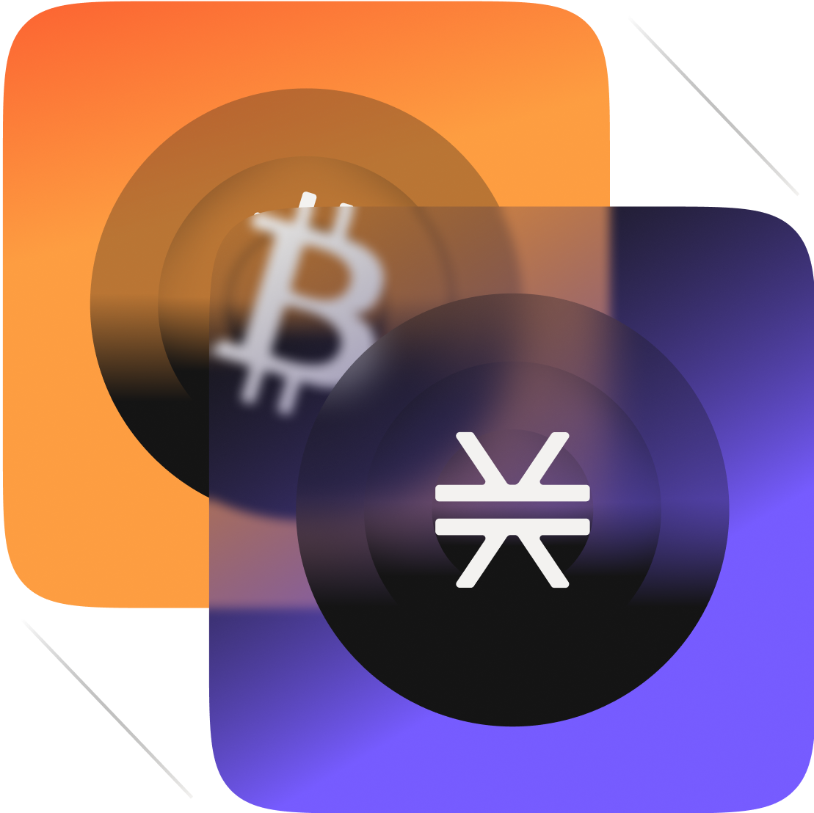

# Clarity Camp | Write ✍🏻 Smart Contracts for ₿itcoin 🪙

👋🏻 Hello, and welcome❗️ My name is abc0xmattyic333 🙋🏼‍♂️.

This repository showcases my journey 🧭 into Clarity. 

Here are a few reasons why I decided to learn Clarity:

- 1. The language itself is pretty new.
- 2. Clarity is a language for writing smart contracts that run on the stacks blockchain.
- 3. Clarity is interpreted, not compiled. Clarity code is interpreted and committed to the chain exactly as written ✍🏻.
- 4. Clarity is decidable, a decidable language has the property that from the code itself, you can know with certainty what the program will do.
- 5. Clarity does not permit reentrancy.
- 6. Clarity guards against overflow and underflows.
- 7. Support for custom tokens 🪙 built-in
- 8. Access to the base chain: ₿itcoin

Clarity smart contracts can read the state of the ₿itcoin base chain. It means you can use ₿itcoin transactions as a trigger in your smart contracts❗️ Clarity also features a number of built-in functions to verify secp256k1 signatures and recover keys 🔑.

To get started learning Clarity, here are several resources 🌱 that I have found:

- [Clarity of Mind 🧠](https://book.clarity-lang.org/title-page.html)

- [Clarity Camp](https://learn.stacks.org/course/clarity-camp)

- [Stacks](https://www.stacks.co/)

- [Stacks Documentation](https://docs.stacks.co/concepts/clarity)

- [Stacks Explorer](https://explorer.hiro.so/?chain=mainnet)

- [Stacks YouTube Channel](https://www.youtube.com/@Stacks-btc)

- [Stacks Developer YouTube Channel](https://www.youtube.com/@Stacks-Developers)

- [Stacks Discord](https://discord.gg/uekCG9RF)

- [Hiro](https://www.hiro.so/)

- [Hiro YouTube Channel](https://www.youtube.com/c/HiroSystems)

- [LearnWeb3 Stacks Developer Degree](https://learnweb3.io/degrees/stacks-developer-degree/)

- [LearnWeb3 YouTube Channel](https://www.youtube.com/@LearnWeb3IO)

- [LearnWeb3 Discord](https://discord.gg/DrtNnFGe)

- [Clarity Github](https://github.com/clarity-lang)

- [Stacks Github](https://github.com/stacks-network)

- [Hiro Github](https://github.com/hirosystems)

- [LearnWeb3 Github](https://github.com/LearnWeb3DAO)

I am excited to be here, I hope you are too❗️🫡
For the next 1️⃣0️⃣0️⃣ days I plan on working on learning Clarity. 
I will document my journey 🧭 daily. I plan to spend about 8-10hrs per day learning Clarity. ⛓️

See you on the other side 🛜 🌐...✌🏻🙂

